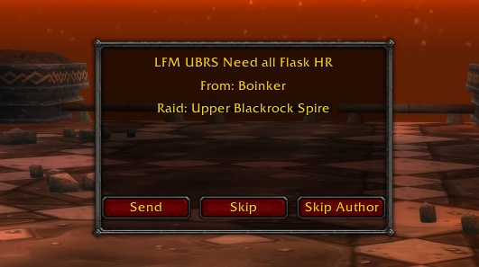
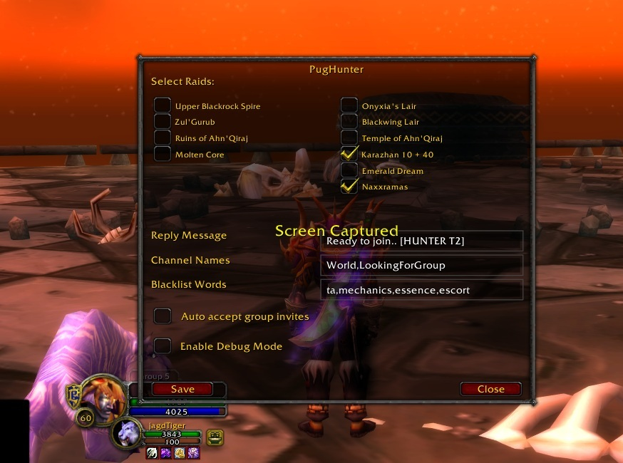
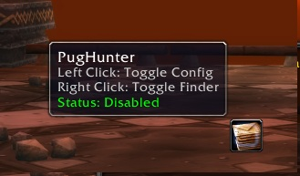

# PugHunter

A World of Warcraft 1.12 (Turtle WoW) addon that helps you find and join PUG raids by monitoring chat channels.

## Screenshots

### Raid Finder Window
<p align="center">
  
</p>

The main interface shows available raids with options to whisper, skip, or ignore players.

### Settings Panel
<p align="center">
  
</p>

Customize your raid monitoring preferences, channels, blacklist words, and auto-reply messages.

### Minimap Integration
<p align="center">
  
</p>

Quick access through the minimap button - left-click to open settings, right-click to toggle the addon.

## Features

- 📢 Monitors selected chat channels (World, LookingForGroup) for raid messages
- 🎯 Customizable raid list with support for common abbreviations
- ⚔️ Supports all major raids: MC, BWL, AQ20/40, ZG, UBRS, NAXX, KARA, ES
- 🚫 Blacklist system for unwanted messages and authors
- 💬 Custom reply message for whispers
- 🎨 Minimap button for quick access
- 🛡️ Auto-join option for party invites
- 🐞 Debug mode for troubleshooting

## Installation

1. Download the addon
2. Extract to your `World of Warcraft/Interface/AddOns` folder
3. Ensure the folder structure is:
   ```
   Interface/AddOns/PugHunter/
   ├── PugHunter.lua
   └── PugHunter.toc
   ```
4. Restart the game or type `/reload`

## Usage

- `/pg` or `/pughunter` - Open configuration window
- Left-click minimap button - Toggle configuration
- Right-click minimap button - Enable/Disable addon

## Configuration

- **Raid Selection**: Choose which raids you want to monitor
- **Reply Message**: Customize your auto-reply whisper
- **Channel Names**: Set which channels to monitor (comma-separated)
- **Blacklist Words**: Add words to filter out unwanted messages
- **Auto Join**: Toggle automatic party invite acceptance
- **Debug Mode**: Enable detailed logging for troubleshooting

## Features in Detail

### Raid Detection
- Monitors chat for raid abbreviations like "MC", "BWL", "ZG"
- Ignores messages containing blacklisted words
- Shows raid name in notification window

### Message Handling
- Shows popup with raid message details
- Options to:
  - Send whisper reply
  - Skip message
  - Ignore player

### Saved Variables
- All settings persist between sessions
- Raid selections are saved per character
- Maintains ignore lists for messages and players

## Support

For issues and suggestions, please create an issue on the project repository.

## Credits

Created by Jan Vancak for Turtle WoW community.

## License

Free to use and modify. Please credit the original author if redistributing.